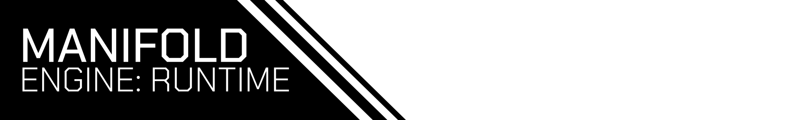

---

This is a framework on top of [ME:Core](https://github.com/dotryen/MECore) that powers [Editor](https://github.com/dotryen/MEEditor).

### Features
- Scripting in Haxe using [HashLink](https://hashlink.haxe.org/)
- Scene Node System
- Vulkan 1.3 (Bindless/Raytracing support)
- Physics via [Jolt Physics](https://github.com/jrouwe/JoltPhysics)
- Virtual File System via [vfspp](https://github.com/nextgeniuspro/vfspp)

### Usage
Add this repository as a submodule and use CMake. **Make sure to update your submodules recursively.**
```cmake
add_subdirectory(vendor/MERuntime EXCLUDE_FROM_ALL)

add_executable(MyAwesomeGame src/game.cpp)
MERuntime_configure(MyAwesomeGame) # This function adds dependencies and custom commands that are required.
```
